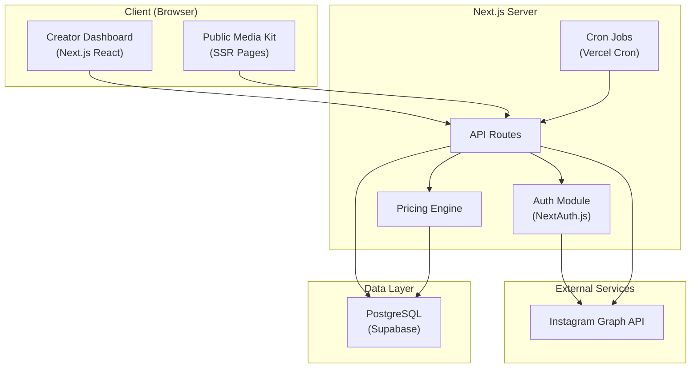
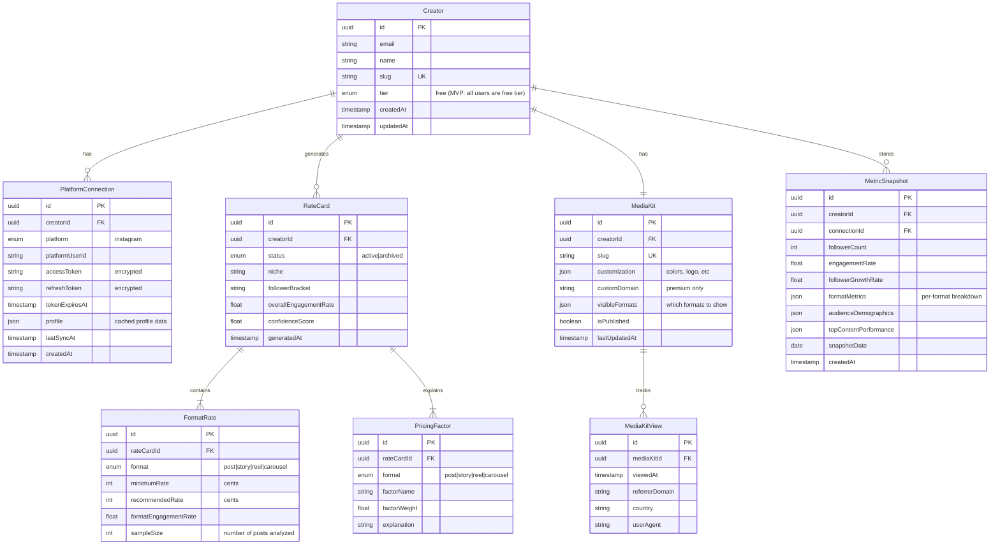

# Design Document: AI Rate Card Generator

## Overview

The AI Rate Card Generator is a standalone web application that helps mid-tier Instagram creators (10K–500K followers) determine fair pricing for brand collaborations. The system connects to a creator's Instagram account via the Instagram Graph API, retrieves engagement data, runs a pricing algorithm, and produces a rate card with per-format pricing recommendations. Creators can share a public media kit link with brands, creating a viral acquisition loop.

### Key Design Decisions

1. **Standalone application** — This is a new product, not an extension of the existing marketing site. It gets its own deployment, database, and auth system.
2. **Next.js full-stack** — Server-side rendering for the public media kit pages (SEO + performance), API routes for backend logic, React for the dashboard. Single deployable unit for MVP speed.
3. **PostgreSQL + Prisma** — Relational data with clear schema for creators, metrics, rate cards, and analytics. Prisma for type-safe queries and easy migrations.
4. **Vercel deployment** — Pairs naturally with Next.js, provides edge functions for media kit pages, and handles SSL/CDN out of the box.
5. **Instagram-only MVP** — The platform connector is designed as a pluggable interface, but only Instagram is implemented for launch.

### Architecture Principles

- Keep the pricing algorithm deterministic and explainable (no black-box ML for MVP)
- Design for the viral loop: media kit pages must be fast, public, and shareable
- Minimize stored data — aggregate metrics, don't store raw post content
- Token security is non-negotiable — encrypt at rest, minimal scopes

## Architecture

### System Architecture Diagram



### Request Flow

1. **Onboarding**: Creator signs up → OAuth with Instagram → System fetches 90 days of metrics → Pricing engine generates rate card → Dashboard displays results
2. **Media Kit View**: Brand visits public URL → SSR renders media kit from database → View event recorded
3. **Refresh**: Vercel Cron triggers weekly → Fetches latest metrics → Recalculates rates → Notifies creator if >15% change

### Tech Stack

| Layer | Technology | Rationale |
|-------|-----------|-----------|
| Framework | Next.js 14 (App Router) | Full-stack React, SSR for media kits, API routes for backend |
| Database | PostgreSQL (Supabase) | Managed Postgres, row-level security, realtime subscriptions |
| ORM | Prisma | Type-safe queries, migrations, schema-first development |
| Auth | NextAuth.js | Built-in OAuth providers, session management |
| Deployment | Vercel | Zero-config Next.js hosting, edge functions, cron jobs |
| Styling | Tailwind CSS | Rapid UI development, consistent design system |

#### P1 (Post-MVP)

| Layer | Technology | Rationale |
|-------|-----------|-----------|
| Cache | Upstash Redis | Serverless Redis for media kit caching and rate limiting — add when traffic justifies it |
| Payments | Stripe | Subscription billing, webhooks for plan changes — add when freemium boundary is enforced |
| Email | Resend | Transactional emails for notifications — add when rate change alerts are implemented |

## Components and Interfaces

### Module Structure

```
src/
├── app/
│   ├── (auth)/           # Login, signup, OAuth callback
│   ├── (dashboard)/      # Protected creator dashboard
│   │   ├── rate-card/    # Rate card view and history
│   │   ├── media-kit/    # Media kit editor
│   │   ├── analytics/    # View analytics
│   │   └── settings/     # Account settings
│   ├── kit/[slug]/       # Public media kit pages (SSR)
│   └── api/
│       ├── auth/         # NextAuth routes
│       ├── instagram/    # IG data fetching
│       ├── rate-card/    # Rate generation endpoints
│       ├── media-kit/    # Media kit CRUD
│       ├── analytics/    # View tracking
│       └── webhooks/     # Stripe webhooks (P1 post-MVP)
├── lib/
│   ├── instagram/        # Instagram API client
│   ├── pricing/          # Pricing algorithm
│   ├── benchmarks/       # Niche benchmark data
│   └── db/               # Prisma client and helpers
├── components/           # Shared UI components
└── types/                # TypeScript type definitions
```

### Core Interfaces

#### Platform Connector Interface

```typescript
interface PlatformConnector {
  platform: 'instagram' | 'youtube' | 'tiktok';
  
  // OAuth flow
  getAuthUrl(redirectUri: string): string;
  exchangeCode(code: string): Promise<OAuthTokens>;
  refreshToken(refreshToken: string): Promise<OAuthTokens>;
  revokeToken(accessToken: string): Promise<void>;
  
  // Data retrieval
  getProfile(accessToken: string): Promise<CreatorProfile>;
  getMediaInsights(accessToken: string, since: Date): Promise<MediaInsight[]>;
  getAudienceDemographics(accessToken: string): Promise<AudienceDemographics>;
  getAccountInsights(accessToken: string, period: DateRange): Promise<AccountInsights>;
}
```

#### Pricing Engine Interface

```typescript
interface PricingEngine {
  calculateRates(input: PricingInput): PricingOutput;
  getExplanation(format: ContentFormat, rate: RateRange): RateExplanation;
}

interface PricingInput {
  engagementMetrics: EngagementMetrics;
  audienceSize: number;
  audienceQuality: AudienceQualityScore;
  niche: ContentNiche;
  contentFormats: ContentFormatMetrics[];
}

interface PricingOutput {
  rates: Map<ContentFormat, RateRange>;
  confidence: number; // 0-1, based on data sufficiency
  factors: PricingFactor[];
}

interface RateRange {
  minimum: number;  // Floor price in USD
  recommended: number;  // Suggested price in USD
}
```

#### Media Kit Service Interface

```typescript
interface MediaKitService {
  generate(creatorId: string): Promise<MediaKit>;
  getPublicKit(slug: string): Promise<PublicMediaKit | null>;
  updateCustomization(creatorId: string, options: MediaKitOptions): Promise<void>;
  recordView(slug: string, metadata: ViewMetadata): Promise<void>;
}
```

### Instagram Connector Implementation

The Instagram connector uses the [Instagram Graph API](https://developers.facebook.com/docs/instagram-platform/instagram-graph-api/) with the following permissions:

- `instagram_business_basic` — Profile info and media list
- `instagram_business_manage_insights` — Media and account insights

Key API endpoints used:
- `GET /{ig-user-id}` — Profile metadata (followers, bio, etc.)
- `GET /{ig-user-id}/media` — List of media objects
- `GET /{ig-media-id}/insights` — Per-media metrics (reach, impressions, engagement, saves, shares)
- `GET /{ig-user-id}/insights` — Account-level metrics (reach, impressions, profile views)
- `GET /{ig-user-id}/insights?metric=audience_city,audience_country,audience_gender_age` — Demographics

**Limitations to handle:**
- Story insights expire after 24 hours (use webhooks for `story_insights` field)
- Account insights data stored for max 90 days
- Rate limits: 200 calls per user per hour
- Some metrics unavailable for accounts with <100 followers

## Data Models

### Entity Relationship Diagram



**P1 (Post-MVP) Entity:**

```
    Subscription {
        uuid id PK
        uuid creatorId FK
        string stripeCustomerId
        string stripeSubscriptionId
        enum status "active|canceled|past_due"
        timestamp currentPeriodEnd
    }
```

### Pricing Algorithm

The pricing algorithm uses a weighted factor model. It's deterministic, explainable, and tunable.

#### Base Rate Calculation

```
BaseRate = FollowerCount × CPM_by_Niche × FormatMultiplier
```

Where:
- **CPM_by_Niche**: Cost per mille (per 1000 followers) varies by content niche. Ranges from $5 (general lifestyle) to $25 (finance/tech).
- **FormatMultiplier**: Adjusts for content format effort and value:
  - Static Post: 1.0×
  - Carousel: 1.3×
  - Story: 0.4×
  - Reel: 1.8×

#### Engagement Multiplier

```
EngagementMultiplier = clamp(CreatorEngagementRate / NicheMedianEngagementRate, 0.6, 2.5)
```

This compares the creator's engagement rate against the median for their niche and bracket. Clamped to prevent extreme outliers from distorting pricing.

#### Audience Quality Score

```
AudienceQualityScore = (
  0.4 × GeoScore +        // % audience in high-CPM countries
  0.3 × GrowthScore +     // Follower growth rate vs. niche median
  0.3 × AuthenticityScore // Comment quality, low bot indicators
)
```

- **GeoScore**: Normalized 0–1 based on audience geographic distribution weighted by advertising CPM per country
- **GrowthScore**: Normalized 0–1 based on 30-day follower growth rate relative to niche median
- **AuthenticityScore**: Normalized 0–1 based on comment-to-like ratio, follower-to-following ratio, engagement consistency

#### Final Rate Formula

```
RecommendedRate = BaseRate × EngagementMultiplier × AudienceQualityScore × RecencyWeight
MinimumRate = RecommendedRate × 0.7
```

Where **RecencyWeight** (0.8–1.2) gives more weight to the last 30 days vs. the full 90-day window.

#### Niche Detection

For MVP, niche detection uses a keyword-based approach on the creator's bio and recent caption text:
1. Extract keywords from bio and last 30 captions
2. Match against a predefined niche taxonomy (fitness, beauty, tech, food, travel, fashion, finance, lifestyle, parenting, gaming)
3. Assign primary niche based on highest keyword density
4. Fall back to "lifestyle" if no clear match

#### Benchmark Data (MVP Approach)

For MVP, benchmark data is seeded from publicly available industry reports and updated quarterly. The system stores median engagement rates and pricing ranges per niche × bracket combination. As the user base grows, real anonymized data supplements the seed data.

```typescript
interface NicheBenchmark {
  niche: ContentNiche;
  followerBracket: FollowerBracket;
  medianEngagementRate: number;
  medianRatePerFormat: Map<ContentFormat, number>;
  topQuartileRate: Map<ContentFormat, number>;
  sampleSize: number;
  lastUpdated: Date;
}
```

## Correctness Properties

*A property is a characteristic or behavior that should hold true across all valid executions of a system — essentially, a formal statement about what the system should do. Properties serve as the bridge between human-readable specifications and machine-verifiable correctness guarantees.*

### Property 1: Pricing algorithm produces valid rate ranges

*For any* valid pricing input (positive follower count, non-negative engagement rate, valid niche, at least one format with ≥5 posts), the pricing algorithm SHALL produce a rate range where minimum > 0 and minimum ≤ recommended for every format with sufficient data.

**Validates: Requirements 3.1, 3.4**

### Property 2: Insufficient data exclusion

*For any* content format with fewer than 5 posts in the analysis window, the system SHALL exclude that format from rate recommendations and the output SHALL NOT contain a rate for that format.

**Validates: Requirements 2.4**

### Property 3: Engagement multiplier is bounded

*For any* creator engagement rate and niche median, the engagement multiplier SHALL be clamped between 0.6 and 2.5, ensuring no single metric can produce extreme pricing distortion.

**Validates: Requirements 3.3**

### Property 4: Rate card contains explanation factors

*For any* generated rate card with at least one format rate, the system SHALL produce at least one pricing factor explanation per format, and each factor SHALL reference a named input signal.

**Validates: Requirements 3.5**

### Property 5: Recency weighting monotonicity

*For any* two metric snapshots where recent content (last 30 days) has higher engagement than older content (31–90 days), the recency-weighted engagement score SHALL be higher than the unweighted average.

**Validates: Requirements 2.5**

### Property 6: Niche benchmark percentile consistency

*For any* creator with engagement rate E and a benchmark dataset for their niche/bracket, the percentile ranking SHALL be consistent with the sorted position of E within the benchmark distribution.

**Validates: Requirements 4.3**

### Property 7: Media kit data freshness

*For any* creator who triggers a rate card refresh, the public media kit SHALL reflect the updated rate data within 5 minutes (i.e., database update propagates to SSR on next request).

**Validates: Requirements 5.5**

### Property 8: Significant change notification threshold

*For any* rate card refresh where the absolute percentage change in recommended rate for any format exceeds 15%, the system SHALL generate a notification event for the creator.

**Validates: Requirements 6.3**

### Property 9: Free tier feature boundary

*For any* free-tier creator, accessing niche benchmark data or media kit customization SHALL return an upgrade prompt rather than the premium data.

**Validates: Requirements 7.3, 7.4, 7.5**

### Property 10: Account deletion data removal

*For any* creator who deletes their account, all stored engagement data, access tokens, and rate card history SHALL be permanently removed, and subsequent queries for that creator's data SHALL return empty results.

**Validates: Requirements 9.3**

### Property 11: Media kit exposes only aggregated data

*For any* public media kit page, the rendered output SHALL contain only aggregated statistics (engagement rate, follower count, rate ranges) and SHALL NOT contain individual post URLs, raw like counts per post, or comment text.

**Validates: Requirements 9.5**

## Error Handling

### Error Categories

| Category | Examples | Strategy |
|----------|----------|----------|
| **Auth Errors** | Token expired, token revoked, invalid scope | Attempt silent refresh; if fails, prompt re-auth with clear messaging |
| **API Rate Limits** | Instagram 200 calls/user/hour exceeded | Exponential backoff with jitter; queue remaining work; show partial results |
| **Insufficient Data** | <5 posts in a format, account too new | Graceful degradation — show available formats, explain what's missing |
| **Payment Errors** | Card declined, subscription lapsed | P1 (Post-MVP): Grace period, downgrade to free tier, email notification |
| **Network Errors** | Instagram API timeout, database unreachable | Retry with backoff (max 3 attempts); serve last stored data if available |
| **Data Integrity** | Negative engagement values, impossible metrics | Validate and sanitize all API responses; log anomalies; skip invalid data points |

### Error Response Format

```typescript
interface AppError {
  code: string;          // Machine-readable: "INSTAGRAM_TOKEN_EXPIRED"
  message: string;       // User-friendly: "Your Instagram connection needs to be refreshed"
  action?: string;       // Suggested action: "reconnect_instagram"
  retryable: boolean;
  details?: unknown;     // Debug info (never exposed to client in production)
}
```

### Graceful Degradation Strategy

1. **Instagram API down**: Show last stored rate card with "Last updated X ago" badge
2. **Partial data retrieval**: Generate rate card for formats with sufficient data, mark others as "pending"
3. **Benchmark data unavailable**: Show rate card without percentile ranking, note "benchmarks updating"
4. **Stripe webhook missed**: P1 (Post-MVP) — Reconcile subscription status on next login via Stripe API check

## Testing Strategy

### Unit Tests

- **Pricing algorithm**: Test with known inputs and expected outputs for each niche/bracket combination
- **Engagement rate calculation**: Verify correct aggregation across content formats
- **Niche detection**: Test keyword matching against known creator profiles
- **Data validation**: Ensure sanitization catches invalid API responses
- **Access control**: Verify free vs. premium feature gating

### Property-Based Tests

Property-based testing is well-suited for this feature because the pricing algorithm is a pure function with a large input space (varying follower counts, engagement rates, niches, format distributions).

**Library**: [fast-check](https://github.com/dubzzz/fast-check) (TypeScript PBT library)

**Configuration**: Minimum 100 iterations per property test.

Each property test references its design document property:
- **Feature: ai-rate-card-generator, Property 1**: Rate range validity
- **Feature: ai-rate-card-generator, Property 2**: Insufficient data exclusion
- **Feature: ai-rate-card-generator, Property 3**: Engagement multiplier bounds
- **Feature: ai-rate-card-generator, Property 4**: Explanation factor presence
- **Feature: ai-rate-card-generator, Property 5**: Recency weighting monotonicity
- **Feature: ai-rate-card-generator, Property 6**: Percentile consistency
- **Feature: ai-rate-card-generator, Property 8**: Significant change threshold

### Integration Tests

- **Instagram OAuth flow**: Mock Instagram API, verify token exchange and storage
- **Data retrieval pipeline**: Mock API responses, verify metric aggregation end-to-end
- **Media kit rendering**: Verify SSR output contains expected sections, no raw data leakage
- **Stripe webhook handling**: P1 (Post-MVP) — Simulate subscription events, verify tier changes
- **Rate card refresh cycle**: Simulate cron trigger, verify data update and notification

### End-to-End Tests

- **Onboarding flow**: Sign up → Connect Instagram → View rate card (< 5 minutes)
- **Media kit sharing**: Generate kit → Visit public URL → Verify view recorded
- **Premium upgrade**: P1 (Post-MVP) — Free user → Subscribe → Access benchmarks
- **Account deletion**: Delete account → Verify all data removed

### Performance Tests

- **Media kit page load**: Target < 3 seconds on standard broadband (Lighthouse CI)
- **Rate card generation**: Target < 60 seconds from data fetch to display
- **API response times**: P95 < 500ms for dashboard endpoints
