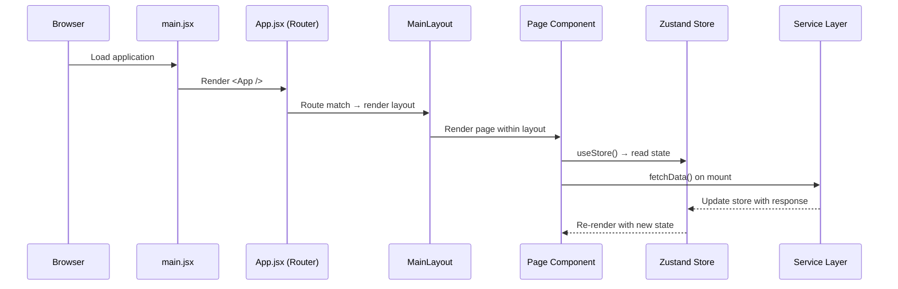

# Design Document: Company Web Application (MVP Phase)

## Overview

A React + Vite single-page application deployed to GitHub Pages, structured for rapid MVP delivery with a scalable architecture. The app uses HashRouter for GitHub Pages compatibility, Zustand for lightweight state management, and a service layer with mock data to simulate API integration.

## Main Algorithm/Workflow



## Core Interfaces/Types

```javascript
// src/services/apiClient.js - Base fetch wrapper interface
/**
 * @typedef {Object} ApiResponse
 * @property {any} data - Response payload
 * @property {boolean} ok - Success indicator
 * @property {number} status - HTTP status code
 * @property {string|null} error - Error message if failed
 */

/**
 * @typedef {Object} RequestConfig
 * @property {string} method - HTTP method (GET, POST, PUT, DELETE)
 * @property {Object} [headers] - Request headers
 * @property {Object|string} [body] - Request body
 * @property {number} [timeout] - Request timeout in ms (default: 10000)
 * @property {AbortSignal} [signal] - AbortController signal
 */

// src/store/appStore.js - Global state shape
/**
 * @typedef {Object} AppState
 * @property {Object|null} user - Current user data
 * @property {boolean} isLoading - Global loading indicator
 * @property {string|null} error - Global error message
 * @property {Object} features - Feature-specific state slices
 */

// src/components/ - Shared component prop interfaces
/**
 * @typedef {Object} ButtonProps
 * @property {string} label - Button text content
 * @property {'primary'|'secondary'|'danger'} [variant] - Visual style
 * @property {'sm'|'md'|'lg'} [size] - Button size
 * @property {boolean} [disabled] - Disabled state
 * @property {boolean} [loading] - Loading state with spinner
 * @property {Function} onClick - Click handler
 * @property {string} [className] - Additional CSS classes
 */

/**
 * @typedef {Object} CardProps
 * @property {string} title - Card heading
 * @property {React.ReactNode} children - Card body content
 * @property {string} [className] - Additional CSS classes
 * @property {Function} [onClick] - Optional click handler
 */

/**
 * @typedef {Object} NavItem
 * @property {string} label - Display text
 * @property {string} path - Route path
 * @property {string} [icon] - Icon identifier
 * @property {boolean} [active] - Active state
 */
```

## Key Functions with Formal Specifications

### Function 1: createApiClient()

```javascript
// src/services/apiClient.js
export function createApiClient(baseURL = '', defaultHeaders = {}) {
  return { get, post, put, del }
}
```

**Preconditions:**
- `baseURL` is a valid URL string or empty string
- `defaultHeaders` is a plain object with string key-value pairs

**Postconditions:**
- Returns an object with `get`, `post`, `put`, `del` methods
- Each method returns a `Promise<ApiResponse>`
- Network errors are caught and returned as `{ ok: false, error: message }`
- Successful responses parse JSON body into `data` field

**Loop Invariants:** N/A

---

### Function 2: useAppStore (Zustand store creator)

```javascript
// src/store/appStore.js
import { create } from 'zustand'

export const useAppStore = create((set, get) => ({
  // State
  user: null,
  isLoading: false,
  error: null,
  features: {},

  // Actions
  setLoading: (isLoading) => set({ isLoading }),
  setError: (error) => set({ error }),
  setUser: (user) => set({ user }),
  setFeatureState: (featureKey, state) =>
    set({ features: { ...get().features, [featureKey]: state } }),
  reset: () => set({ user: null, isLoading: false, error: null, features: {} }),
}))
```

**Preconditions:**
- Zustand library is installed and importable
- `featureKey` is a non-empty string when calling `setFeatureState`

**Postconditions:**
- Store is a singleton accessible via `useAppStore()` hook in any component
- `setLoading(true)` → `get().isLoading === true`
- `setError(msg)` → `get().error === msg`
- `setFeatureState(key, val)` → `get().features[key] === val` without mutating other feature keys
- `reset()` → state returns to initial values

**Loop Invariants:** N/A

---

### Function 3: MainLayout component

```javascript
// src/layouts/MainLayout.jsx
export function MainLayout({ children }) {
  return (
    <div className="app-layout">
      <Navbar />
      <main className="main-content">{children}</main>
      <Footer />
    </div>
  )
}
```

**Preconditions:**
- `children` is valid React node(s)
- `Navbar` and `Footer` components are importable

**Postconditions:**
- Renders semantic HTML structure with nav, main, footer
- `children` are rendered inside `<main>` element
- Layout is accessible: main content is within `<main>` landmark

**Loop Invariants:** N/A

---

### Function 4: Router configuration

```javascript
// src/App.jsx
import { HashRouter, Routes, Route } from 'react-router-dom'

export default function App() {
  return (
    <HashRouter>
      <Routes>
        <Route element={<MainLayout />}>
          <Route index element={<HomePage />} />
          <Route path="about" element={<AboutPage />} />
          <Route path="features" element={<FeaturesPage />} />
          <Route path="*" element={<NotFoundPage />} />
        </Route>
      </Routes>
    </HashRouter>
  )
}
```

**Preconditions:**
- `react-router-dom` v6+ is installed
- All page components are importable
- `MainLayout` uses `<Outlet />` for nested route rendering

**Postconditions:**
- HashRouter prevents 404 on GitHub Pages direct navigation
- Unknown routes render `NotFoundPage`
- All routes render within `MainLayout` wrapper
- Navigation between routes does not cause full page reload

**Loop Invariants:** N/A

---

### Function 5: useFetch custom hook

```javascript
// src/hooks/useFetch.js
export function useFetch(fetchFn, { immediate = true, deps = [] } = {}) {
  const [data, setData] = useState(null)
  const [loading, setLoading] = useState(immediate)
  const [error, setError] = useState(null)

  const execute = useCallback(async (...args) => {
    setLoading(true)
    setError(null)
    try {
      const result = await fetchFn(...args)
      setData(result.data)
      return result
    } catch (err) {
      setError(err.message)
      return { ok: false, error: err.message }
    } finally {
      setLoading(false)
    }
  }, deps)

  useEffect(() => {
    if (immediate) execute()
  }, [execute, immediate])

  return { data, loading, error, execute, setData }
}
```

**Preconditions:**
- `fetchFn` is an async function returning `ApiResponse`
- `deps` is a stable array of dependency values
- Component using this hook is mounted

**Postconditions:**
- If `immediate === true`, `fetchFn` is called on mount
- During fetch: `loading === true`, `error === null`
- On success: `data` contains response data, `loading === false`
- On failure: `error` contains error message, `data` remains previous value
- `execute` can be called manually to re-trigger fetch
- Cleanup: no state updates after unmount (via AbortController pattern)

**Loop Invariants:** N/A

## Algorithmic Pseudocode

### API Client Request Algorithm

```javascript
// src/services/apiClient.js - Core request implementation
async function request(url, config = {}) {
  const { method = 'GET', headers = {}, body, timeout = 10000, signal } = config

  // Step 1: Create abort controller for timeout
  const controller = new AbortController()
  const timeoutId = setTimeout(() => controller.abort(), timeout)
  const mergedSignal = signal || controller.signal

  try {
    // Step 2: Execute fetch with merged configuration
    const response = await fetch(url, {
      method,
      headers: { 'Content-Type': 'application/json', ...defaultHeaders, ...headers },
      body: body ? JSON.stringify(body) : undefined,
      signal: mergedSignal,
    })

    // Step 3: Parse response
    const data = response.headers.get('content-type')?.includes('application/json')
      ? await response.json()
      : await response.text()

    // Step 4: Return normalized response
    return {
      data,
      ok: response.ok,
      status: response.status,
      error: response.ok ? null : data?.message || `HTTP ${response.status}`,
    }
  } catch (err) {
    // Step 5: Handle network/timeout errors
    return {
      data: null,
      ok: false,
      status: 0,
      error: err.name === 'AbortError' ? 'Request timeout' : err.message,
    }
  } finally {
    clearTimeout(timeoutId)
  }
}
```

**Preconditions:**
- `url` is a valid URL string
- `config.method` is a valid HTTP method
- Network is available (graceful degradation if not)

**Postconditions:**
- Always returns an `ApiResponse` object (never throws)
- Timeout aborts request after specified duration
- JSON responses are automatically parsed
- Non-JSON responses returned as text

**Loop Invariants:** N/A

---

### Mock Service Pattern Algorithm

```javascript
// src/services/mockData.js - Mock data service for MVP phase
const MOCK_DELAY = 300 // Simulate network latency

export async function mockFetch(dataPath) {
  // Step 1: Simulate network delay
  await new Promise((resolve) => setTimeout(resolve, MOCK_DELAY))

  // Step 2: Dynamically import mock JSON
  try {
    const module = await import(`../data/${dataPath}.json`)
    return { data: module.default, ok: true, status: 200, error: null }
  } catch (err) {
    return { data: null, ok: false, status: 404, error: `Mock data not found: ${dataPath}` }
  }
}
```

**Preconditions:**
- `dataPath` corresponds to a JSON file in `src/data/` directory
- JSON files contain valid JSON data

**Postconditions:**
- Returns after simulated delay (non-zero)
- Success: returns parsed JSON as `data`
- Failure: returns descriptive error with 404 status
- Interface matches `ApiResponse` shape for seamless swap to real API

---

### Vite Configuration

```javascript
// vite.config.js
import { defineConfig } from 'vite'
import react from '@vitejs/plugin-react'

export default defineConfig({
  base: process.env.VITE_BASE_PATH || '/',
  plugins: [react()],
  resolve: {
    alias: {
      '@': '/src',
      '@components': '/src/components',
      '@hooks': '/src/hooks',
      '@services': '/src/services',
      '@store': '/src/store',
      '@utils': '/src/utils',
      '@layouts': '/src/layouts',
      '@pages': '/src/pages',
      '@assets': '/src/assets',
    },
  },
  build: {
    outDir: 'dist',
    sourcemap: false,
    rollupOptions: {
      output: {
        manualChunks: {
          vendor: ['react', 'react-dom', 'react-router-dom'],
          state: ['zustand'],
        },
      },
    },
  },
})
```

---

### Deployment Scripts Configuration

```json
// package.json (relevant sections)
{
  "name": "company-web-app",
  "private": true,
  "version": "0.1.0",
  "type": "module",
  "homepage": "https://<GITHUB_USERNAME>.github.io/<REPO_NAME>/",
  "scripts": {
    "dev": "vite",
    "build": "vite build",
    "preview": "vite preview",
    "predeploy": "npm run build",
    "deploy": "gh-pages -d dist",
    "lint": "eslint . --ext js,jsx --report-unused-disable-directives --max-warnings 0"
  },
  "dependencies": {
    "react": "^18.2.0",
    "react-dom": "^18.2.0",
    "react-router-dom": "^6.20.0",
    "zustand": "^4.4.0"
  },
  "devDependencies": {
    "@vitejs/plugin-react": "^4.2.0",
    "eslint": "^8.55.0",
    "eslint-plugin-react-hooks": "^4.6.0",
    "gh-pages": "^6.1.0",
    "vite": "^5.0.0"
  }
}
```

## Example Usage

```javascript
// Example 1: Using the API client in a service module
// src/services/featureService.js
import { createApiClient } from './apiClient'
import { mockFetch } from './mockData'

const api = createApiClient(import.meta.env.VITE_API_URL || '')
const USE_MOCKS = import.meta.env.VITE_USE_MOCKS === 'true'

export async function getFeatures() {
  if (USE_MOCKS) return mockFetch('features')
  return api.get('/api/features')
}

export async function getFeatureById(id) {
  if (USE_MOCKS) return mockFetch(`features/${id}`)
  return api.get(`/api/features/${id}`)
}

// Example 2: Using useFetch hook in a page component
// src/pages/FeaturesPage.jsx
import { useFetch } from '@hooks/useFetch'
import { getFeatures } from '@services/featureService'
import { Card } from '@components/Card'

export function FeaturesPage() {
  const { data: features, loading, error } = useFetch(getFeatures)

  if (loading) return <div role="status" aria-label="Loading">Loading...</div>
  if (error) return <div role="alert">Error: {error}</div>

  return (
    <section aria-labelledby="features-heading">
      <h1 id="features-heading">Features</h1>
      <div className="features-grid">
        {features?.map((feature) => (
          <Card key={feature.id} title={feature.name}>
            <p>{feature.description}</p>
          </Card>
        ))}
      </div>
    </section>
  )
}

// Example 3: Using Zustand store for global state
// src/pages/HomePage.jsx
import { useAppStore } from '@store/appStore'

export function HomePage() {
  const { user, isLoading } = useAppStore()
  const setUser = useAppStore((state) => state.setUser)

  return (
    <section aria-labelledby="home-heading">
      <h1 id="home-heading">Welcome{user ? `, ${user.name}` : ''}</h1>
      {isLoading && <p role="status">Loading...</p>}
    </section>
  )
}

// Example 4: Reusable Button component
// src/components/Button.jsx
export function Button({
  label,
  variant = 'primary',
  size = 'md',
  disabled = false,
  loading = false,
  onClick,
  className = '',
}) {
  return (
    <button
      className={`btn btn--${variant} btn--${size} ${className}`}
      disabled={disabled || loading}
      onClick={onClick}
      aria-busy={loading}
    >
      {loading ? <span className="spinner" aria-hidden="true" /> : null}
      {label}
    </button>
  )
}

// Example 5: Application entry point
// src/main.jsx
import React from 'react'
import ReactDOM from 'react-dom/client'
import App from './App'
import './assets/styles/global.css'

ReactDOM.createRoot(document.getElementById('root')).render(
  <React.StrictMode>
    <App />
  </React.StrictMode>
)
```

## Correctness Properties

*A property is a characteristic or behavior that should hold true across all valid executions of a system—essentially, a formal statement about what the system should do. Properties serve as the bridge between human-readable specifications and machine-verifiable correctness guarantees.*

### Property 1: API Client Response Shape Normalization

*For any* HTTP request (successful or failed, any method, any URL), the API_Client SHALL return an object containing exactly the fields `data`, `ok` (boolean), `status` (number), and `error` (string or null), and SHALL never throw an exception.

**Validates: Requirements 9.1, 9.2, 9.3**

### Property 2: HashRouter Route Preservation

*For any* valid route path in the application, navigating to that path and then simulating a page refresh SHALL result in the same route being active and the same page content being rendered.

**Validates: Requirements 6.3, 6.5**

### Property 3: Zustand Store Feature State Isolation

*For any* existing store state with multiple feature keys, calling `setFeatureState(key, value)` SHALL update only the specified key and leave all other feature keys unchanged.

**Validates: Requirement 8.2**

### Property 4: Zustand Store Reset Idempotence

*For any* store state (regardless of how many mutations have been applied), calling `reset()` SHALL return the store to its exact initial state with user=null, isLoading=false, error=null, and features={}.

**Validates: Requirement 8.3**

### Property 5: useFetch Hook Deterministic Lifecycle

*For any* async fetch function, the useFetch hook SHALL transition through states deterministically: during fetch loading=true and error=null; on success data=response and loading=false; on failure error=message and loading=false. Loading SHALL never be true in the final settled state.

**Validates: Requirements 10.2, 10.3, 10.4**

### Property 6: Mock Service Interface Equivalence

*For any* mock service call, the returned response object SHALL have the identical shape (data, ok, status, error fields) as the API_Client response, ensuring components behave identically regardless of data source.

**Validates: Requirement 9.5**

### Property 7: Route Exhaustiveness (Wildcard Catch-All)

*For any* URL path not matching a defined route, the Router SHALL render the Not Found page rather than a blank screen or error.

**Validates: Requirement 6.4**

### Property 8: Navigation Route Rendering Without Reload

*For any* navigation link click to a valid route, the Router SHALL render the corresponding page component without triggering a full browser page reload.

**Validates: Requirement 6.2**

### Property 9: Layout Semantic Landmarks on All Pages

*For any* rendered page in the application, the Layout SHALL contain semantic HTML landmark elements: a `<nav>` element, a `<main>` element, and a `<footer>` element.

**Validates: Requirements 7.1, 7.2**

### Property 10: Product Card Rendering Completeness

*For any* set of product data returned by the Service_Layer, the Products page SHALL render one card per product, and each card SHALL display the product's name and description.

**Validates: Requirement 5.6**

### Property 11: Loading State ARIA Communication

*For any* component in a loading state, the rendered output SHALL include either `role="status"` or `aria-busy="true"` to communicate the loading state to assistive technology.

**Validates: Requirements 5.4, 11.3**

### Property 12: Error State ARIA Communication

*For any* component displaying an error from the Service_Layer, the rendered output SHALL include `role="alert"` to announce the error to assistive technology.

**Validates: Requirements 5.5, 11.4**

### Property 13: Contact Form Validation Rejects Empty Fields

*For any* combination of empty required fields in the Contact_Form, submission SHALL be prevented and validation errors SHALL be displayed indicating which specific fields need attention.

**Validates: Requirement 3.4**

### Property 14: Contact Form Error Preserves Input

*For any* form input state, if the contact submission fails, the user's previously entered data SHALL remain in the form fields without being cleared.

**Validates: Requirement 3.5**

### Property 15: Button Loading State Behavior

*For any* Button component in a loading state, the component SHALL display a spinner, set `aria-busy` to true, and prevent click handler invocation.

**Validates: Requirements 13.4, 11.2**

### Property 16: Store Error State Update

*For any* string message passed to `setError`, the Store's error property SHALL equal that exact message.

**Validates: Requirement 8.5**

### Property 17: Active Navigation Indicator

*For any* current route in the application, the Navigation component SHALL visually mark the corresponding link as active.

**Validates: Requirement 6.6**
